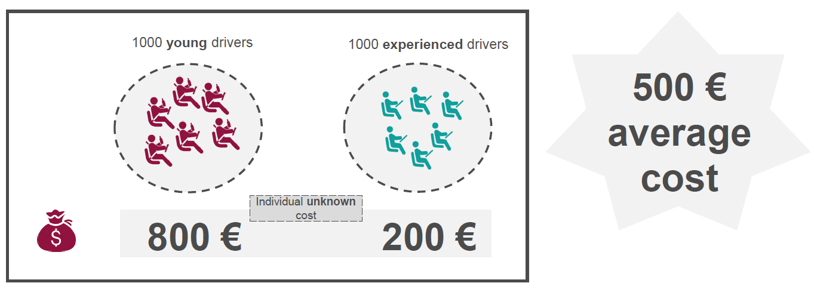
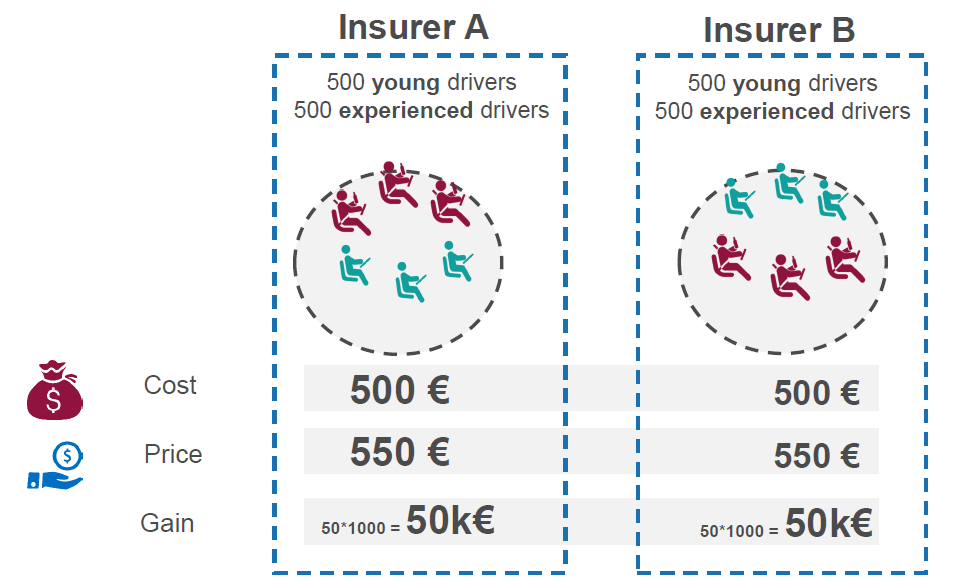
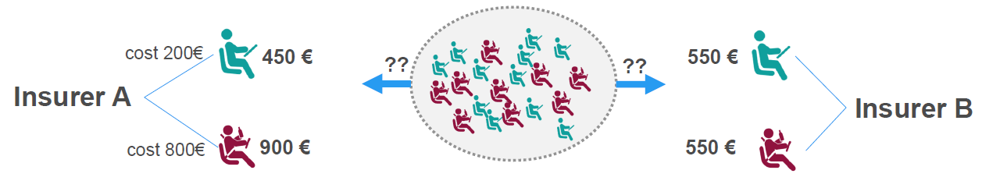
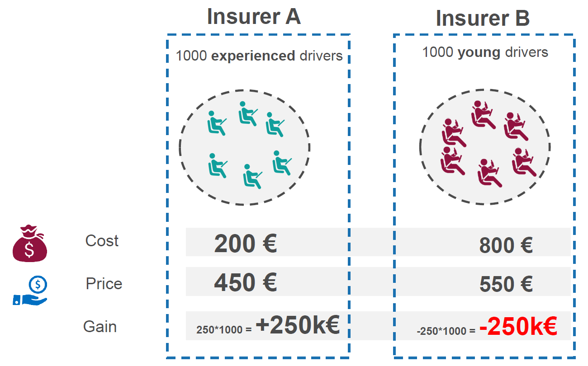

```{r setup, include=FALSE}
knitr::opts_chunk$set(echo = TRUE)
```

# Assurance vs les autres industries?

## Quelles sont les similarités entre l'assurance et les autres industries?

$$CP_i = PP_i + L_i + M_i$$

  - $CP_i$: prime commerciale
  - $PP_i$: prime pure
  - $L_i$: les frais associé
  - $M_i$: la marge

## Quelles sont les différences entre l'assurance et les autres industries?

L'**inversion du cycle de production**:

  - $PP_i$ est *inconnu* pour une compagnie d'assurance
  - $PP_i$ est presque *connu* pour les autres industries
  
Les primes doivent permettre de faire face à un niveau normal de sinistres à payer mais en pratique le risque à venir peut être illimité.


Exemple d'un sinistre important en assurance automobile (Mont Blanc)  # TODO: complete this 

# Anti-selection {.tabset}

Supposons qu'il y a deux types de prospects sur le marché:




## Le marché non segmenté
Supposons maintenant qu'il y a deux assureurs A & B. Les deux proposent le même tarif (500€ pour tous les prospects)



**Conclusion**: Dans le marché où il n'y a pas de segmentation de tarif, tout le monde a:

   - le même portefeuille
   - le même profit

## Le marché avec de la segmentation

Supposons maintenant que: 

  - L'assureur A est capable de prédire que les jeunes conducteurs coutent plus cher que les conducteurs expérimentés
  - L'assureur A décide de changer leur stratégie tarifaire:
    - Ils propose 900€, au lieu de 500€ aux jeunes conducteurs
    - Ils popose 450€, au lieu de 500€ aux conducteurs expréimentés
  - L'assureur B propose toujours 500€, peu import le profil de conducteurs.
Les prospects ont maintenant un choix d'assureurs:



Le portefuilles des deux assureurs sera:
    


**Conclusion**: l'assureur qui prédit mieux les risques est celui qui gagne!